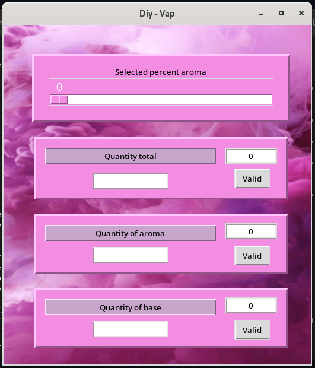

# App_Diy_Conversion
## Application for DIY - Vape to make the composition of its E-liquid.
#
## Installation & launch :
- **Clone the repository**  
`git clone https://github.com/Mike-mg/App_Diy_Conversion.git`
- **Go to the Password_Init_And_Storage folder**
- **Creating a working environment**  
`mkdir .venv`  
`pipenv install` ( Will install packages and dependencies )
- **Activate the work environment**  
`pipenv shell`
- **To disable the working environment**  
`deactivate`
#
## Running the program
- **Run the program with the following command**  
`python main.py`
####
- **The main window - Girly No ?!** 

  
####
- **How it works**
1. Select a percent aroma
2. Enter the quantity total or quantity of aroma or quantity of base
3. Click on valid

> **The program then indicates the quantity for each liquid dosage.**